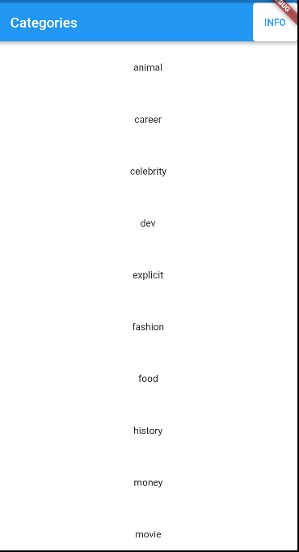
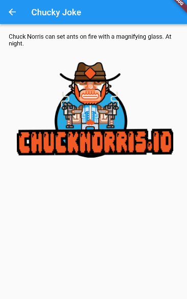
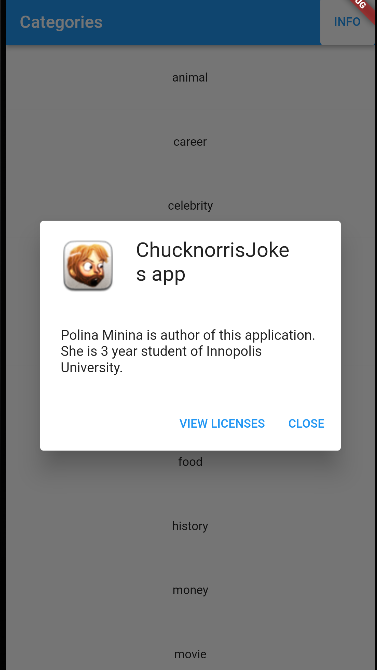

Application show categories of the jokes? so you can choose one and see the joke.

Also you can refresh jokes by going back to main page and click to category.

Categories is downloaded automatically from API. To refresh them you need to reopen application.

There is an About Dialog, where you can see info about developer and name of the app.
Link to download apk: https://drive.google.com/file/d/1Bdn4WAVDh-2TWiKQ2KNap6UvHF0OMGIr/view?usp=sharing

Screenshoots:

Main page:

Joke page:

Info page:

